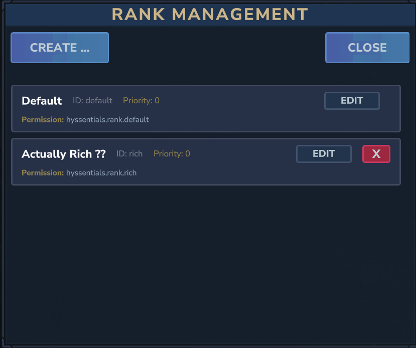

# Hyssentials

Essential server commands and a powerful rank system for Hytale.

## Features

- **Teleport Requests (TPA)** - Request to teleport to other players
- **Homes** - Save and teleport to personal locations
- **Warps** - Server-wide teleport points
- **Random Teleport** - Teleport to random safe locations
- **Spawn** - Quick teleport to server spawn
- **Back** - Return to previous location (works after death!)
- **Rank System** - Fully customizable ranks with in-game UI
- **Per-Rank Settings** - Configure cooldowns, warmups, and home limits per rank

## Documentation

**[View Full Documentation](docs/index.html)** - Comprehensive guide for players and admins

## Quick Start

### Player Commands

| Command | Description |
|---------|-------------|
| `/tpa <player>` | Request to teleport to a player |
| `/tpahere <player>` | Request a player to teleport to you |
| `/tpaccept` / `/tpdeny` | Accept or deny teleport requests |
| `/sethome <name>` | Save your current location |
| `/home <name>` | Teleport to a saved home |
| `/homes` | List all your homes |
| `/warp <name>` | Teleport to a server warp |
| `/warps` | List all warps |
| `/spawn` | Teleport to spawn |
| `/rtp` | Random teleport (aliases: `/randomtp`, `/wild`) |
| `/back` | Return to previous location |

### Admin Commands

| Command | Description |
|---------|-------------|
| `/hyssentials rank` | Open rank management UI |
| `/hyssentials assign` | Open player rank assignment UI |
| `/hyssentials setrank <player> <rank>` | Give a rank to a player |
| `/hyssentials removerank <player> <rank>` | Remove a rank from a player |
| `/hyssentials playerinfo <player>` | View player's rank info |
| `/hyssentials reload` | Reload configuration |
| `/setwarp <name>` | Create a server warp |
| `/delwarp <name>` | Delete a warp |
| `/setspawn` | Set server spawn |
| `/htp <player>` | Teleport to a player |
| `/htphere <player>` | Teleport a player to you |

*Tip: Use `/hys` as a shortcut for `/hyssentials`*

## Rank System

Hyssentials features a fully customizable rank-based configuration system with an in-game UI.

### Per-Rank Configuration
- **Max Homes** - How many homes each rank can set
- **Cooldowns** - Time between command uses (per command)
- **Warmups** - Delay before teleport (moving cancels it)
- **Command Access** - Enable/disable commands per rank
- **Granted Permissions** - Additional permissions from other plugins

### Default Ranks

| Rank | Permission | Max Homes | Cooldowns |
|------|------------|-----------|-----------|
| Default | `hyssentials.rank.default` | 5 | 60 seconds |
| VIP | `hyssentials.rank.vip` | 10 | None |

## Configuration Files

| File | Description |
|------|-------------|
| `config.json` | Global settings |
| `ranks.json` | Rank definitions |
| `homes.json` | Player home locations |
| `warps.json` | Server warp points |
| `spawn.json` | Custom spawn point |

## Permissions

### Admin Permissions
- `hyssentials.admin.ranks` - Access rank management UI
- `hyssentials.admin.setrank` - Assign/remove ranks
- `hyssentials.admin.playerinfo` - View player info
- `hyssentials.admin.reload` - Reload configuration
- `hyssentials.setspawn` - Set server spawn
- `hyssentials.setwarp` / `hyssentials.delwarp` - Manage warps
- `hyssentials.htp` / `hyssentials.htphere` - Admin teleport

### Special Permissions
- `hyssentials.cooldown.bypass` - Bypass all cooldowns and warmups

### Legacy Permissions (Backwards Compatible)
- `hyssentials.vip` - Maps to VIP rank
- `hyssentials.vip.homes` - Extended home limit
- `hyssentials.vip.cooldown` - Reduced cooldowns

## Support

Join our [Discord](https://discord.gg/m4EHeRjfZ9) for support and updates!

---

If you'd like to support me and the development of my mods, I recommend trying out BisectHosting. Use code "project8gbderam" to get 25% off your first month of a gaming server for new customers. They offer 24/7 support and lightning-fast response times, ensuring you're in great hands and providing exceptional assistance for all your gaming needs.

